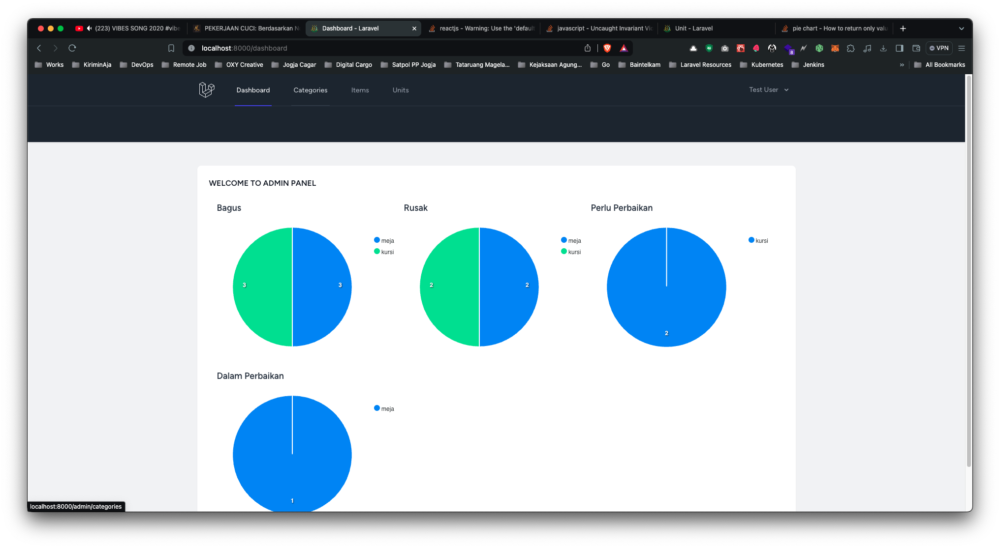
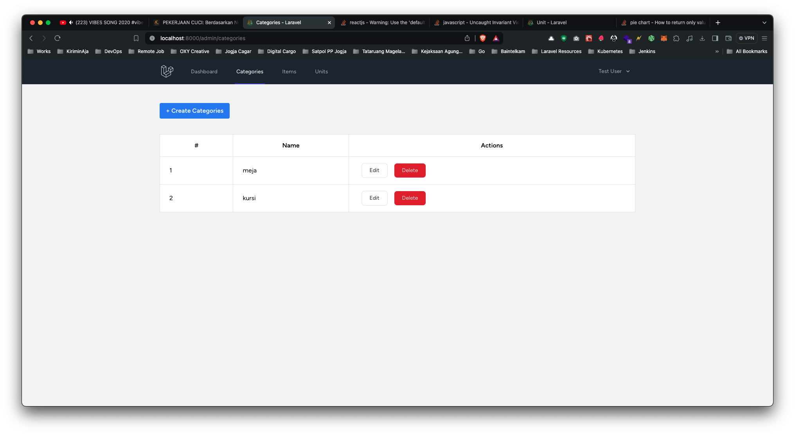
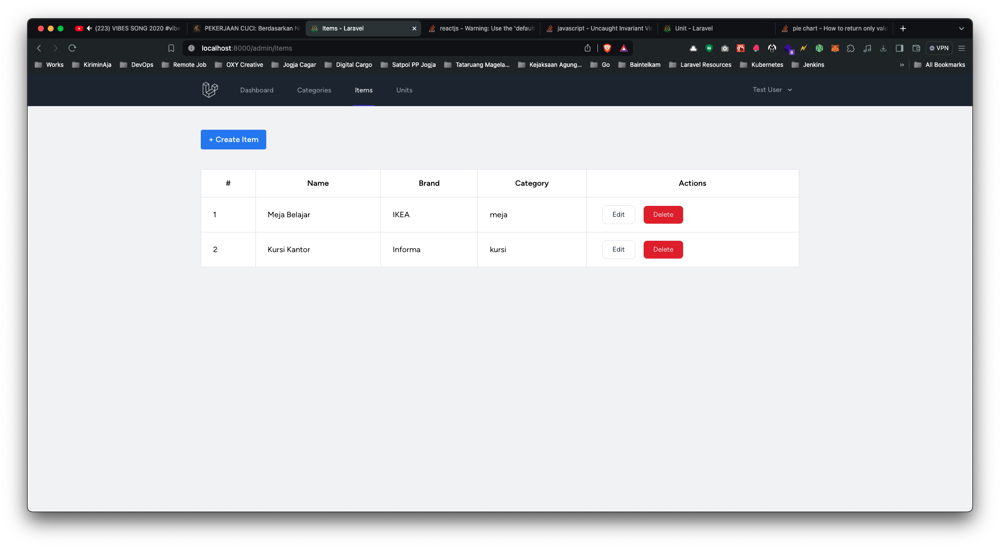
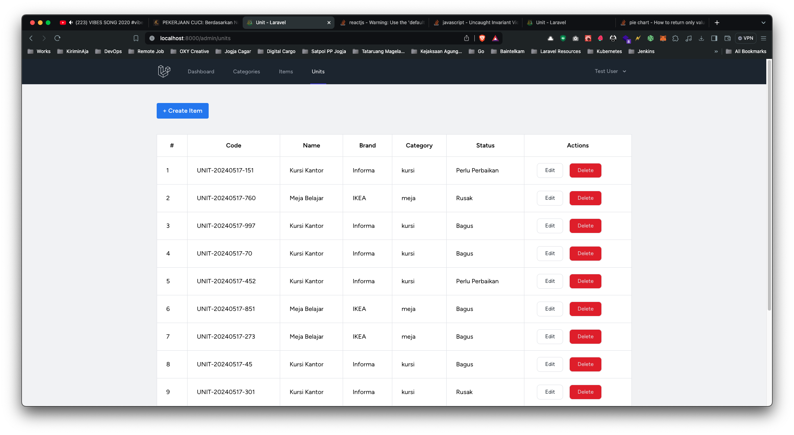

<p align="center"><a href="https://laravel.com" target="_blank"></a></p>

<p align="center">
<a href="https://github.com/laravel/framework/actions"></a>
<a href="https://packagist.org/packages/laravel/framework"></a>
<a href="https://packagist.org/packages/laravel/framework"></a>
<a href="https://packagist.org/packages/laravel/framework"></a>
</p>

## 📽️ About ADMIN PANEL

a simple application for managing data and providing it to a chart for statistics

## 🌟 Getting Started

These instructions will get you a copy of the project up and running on your local machine for development and testing purposes. See deployment for notes on how to deploy the project on a live system.

## 🚀 Prerequiste

-   [Composer](https://getcomposer.org/) - Download and Install Composer
-   Minimum PHP 8.2
-   MySQL
-   Yarn
-   Docker (Optional)

## 🔑 Tools

-   Terminal (OhMyZSH)
-   Code Editor : Visual Studio Code
-   Web Server : NginX
-   Database Server : MySQL
-   GUI Database Management : DBeaver
-   Container Management : Docker Desktop

### 🖥️ Stacks

-   PHP 8.2
-   Laravel 11
-   MySQL
-   InertiaJS
-   React + TypeScript
-   React Hook Form
-   React ApexChart, Zod Validation, and many more
-   TailwindCSS
-   Docker (using Laravel Sail)

## 🚀 Installation And Usage

-   Run this command, to clone the project.

```
git clone https://github.com/Zainal21/admin-panel

cd admin-panel
```

-   Run this command, to install dependency for running the application.

```
composer install
```

```
yarn install
```

-   Setup your env variable based on your environment

```
cp .env.example .env
```

-   Run this command, to migrate the database to your local machine.

```
:: Call Action to Migrate Database
php artisan migrate --seed

:: Create Secret Key Laravel App
php artisan key:generate
```

-   Run this command, to running the application.

```
:: Command To Running Backend Service (Run Manually)
php artisan serve

:: Command To Running Frontend Service (Run Manually)
yarn dev
```

-   Running using Laraval Sail (Docker - Recommended)

```
:: Command To Running Container
./vendor/bin/sail up -d


:: Command To Stop Container
./vendor/bin/sail down


:: Command To Run Laravel Artisan Command
./vendor/bin/sail artisan ____
```

## 📷 Screen Example

-   Dummy User

    -   email test@example.com
    -   password : password

-   Dashboard Charts
    
-   Manage Category
    

-   Manage Item
    

-   Manage Unit
    

## 👤 Author

-   Muhamad Zainal Arifin

## 📝 License

Copyright © 2024 Muhamad Zainal Arifin.
This project is MIT licensed.

The Laravel framework is open-sourced software licensed under the [MIT license](https://opensource.org/licenses/MIT).
